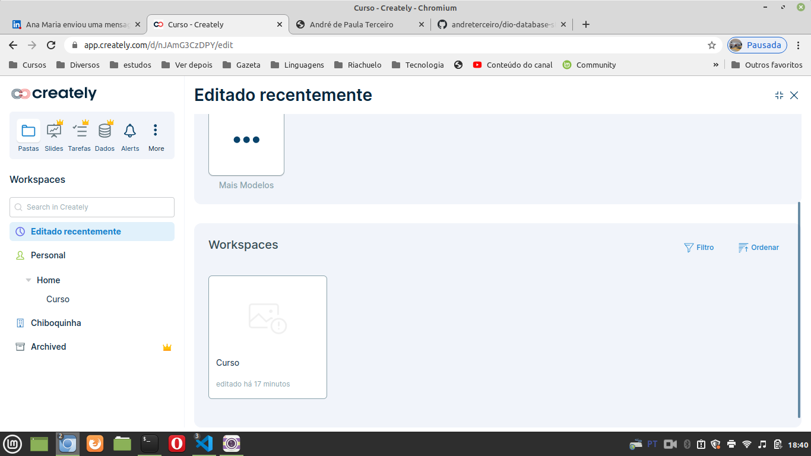

# General

[Initial class](https://web.dio.me/course/introducao-a-banco-de-dados-relacionais-sql/learning/bdaaa5d8-2d86-49e6-b166-ae890d0112b0?back=/track/coding-the-future-claro-java-spring-boot&tab=undefined&moduleId=undefined)

I used [Creately](https://app.creately.com/) to make some diagrams as I learned in the course.

I accessed the "Curso" workspace 

I talk about Creately [in this video](https://youtu.be/F1A5UvZYZ_k).

In [this class](https://web.dio.me/course/introducao-a-banco-de-dados-relacionais-sql/learning/5e407a8c-9d57-4a20-965c-90d5208fb751?back=/track/coding-the-future-claro-java-spring-boot&tab=undefined&moduleId=undefined) the teacher created a database [in this site](https://clients.cloudclusters.io/). As the trial options were not exhibited to me, I created the database using the tools provided to my Hostinger acount.

Access data:
- hostname: please access [this link](https://auth-db1446.hstgr.io/index.php?db=u257595541_viagens) after loggin in in the administration pannel;
- database: u257595541_viagens
- username: u257595541_viagens
- password: if you access using the previous link, a password will be not necessary.