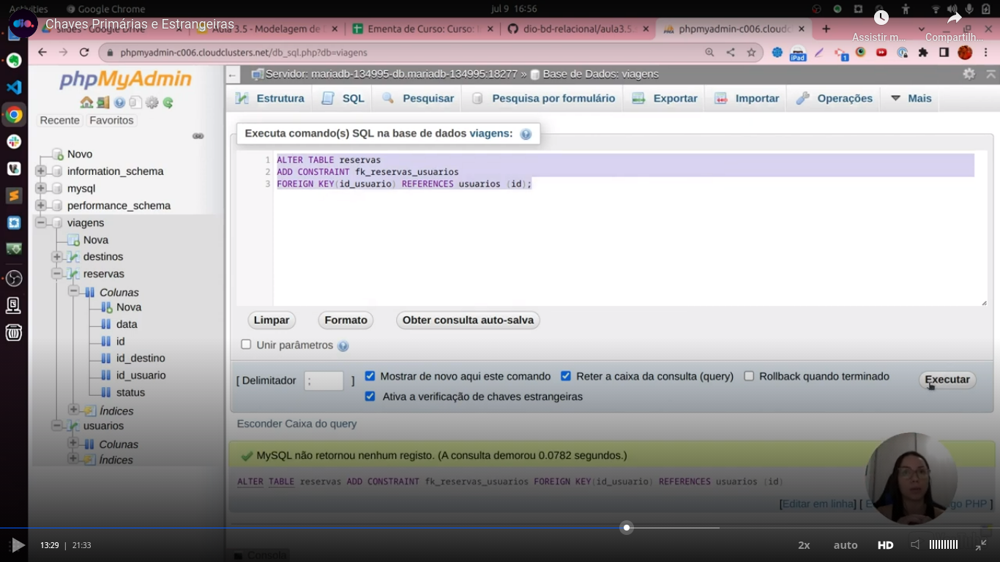

# General

[Initial class](https://web.dio.me/course/introducao-a-banco-de-dados-relacionais-sql/learning/bdaaa5d8-2d86-49e6-b166-ae890d0112b0?back=/track/coding-the-future-claro-java-spring-boot&tab=undefined&moduleId=undefined)

I used [Creately](https://app.creately.com/) to make some diagrams as I learned in the course.

I accessed the "Curso" workspace 

I talk about Creately [in this video](https://youtu.be/F1A5UvZYZ_k).

In [this class](https://web.dio.me/course/introducao-a-banco-de-dados-relacionais-sql/learning/5e407a8c-9d57-4a20-965c-90d5208fb751?back=/track/coding-the-future-claro-java-spring-boot&tab=undefined&moduleId=undefined) the teacher created a database [in this site](https://clients.cloudclusters.io/). As the trial options were not exhibited to me, I created the database using the tools provided to my Hostinger acount.

Access data:
- hostname: please access [this link](https://hpanel.hostinger.com/websites/terceiro.com.br/databases/php-my-admin?redirectLocation=side_menu)
after loggin in in the administration pannel;
- database: u257595541_viagens
- username: u257595541_viagens
- password: if you access using the previous link, a password will be not necessary.

**OBS:** you will need to click in the **'Entrar no phpMyAdmin'** of the specific database.

This basically is what was teached about the creation of a table:


About the `select`or `insert` clausule I didn't learn any news except that I can use `<>` or `!=` in comparision with the meaning of "different" (I always used only "!=").

In the class about `update`and `delete` clausules I didn't noted any new information based in my current knowloegde.

The teacher used an interesting `insert ... select` in the class as you can see in the next image:


The teacher also renamed a table:


Modifying a column:


A important information to remember is that we can only have one `primary key`.


We can have null values in a `foreign key`:


Pay attention that the question of a `foreign key` receives a null value or no depends if that column received a `NULL` or `NOT NULL` constraint. Please see the insertion in `PHPMyAdmin`. There we have both:

- a null checkbok. The meaning is that the column in the register will receive a `NULL` value;
- the combobox (or select box) with specific values that are in the another table (where the reference points to). When you select a value the checkbox to select `null` as the value of the column is automatically selected.

The `SQL` clausule to create a foreign key in different SGDBs is showed [here](https://www.w3schools.com/sql/sql_foreignkey.asp).


In the previous image I was talking about `foreign keys`. The command showed a way of creation `primary keys` that works also in MySQL.

Also you can saw in the image that we can have more than one `foreign key`. If you think with calm is obvious, is necessary only point to different tables, like tables to store order items (on column point to a order and another column point to a item).

Adding a constraint:


Restrictions on constraits. I never used **"SET DEFAULT"**, interesting:


Adding a `primary key` through `alter table`, one way:


Adding a `foreign key` through `alter table`, one way:


Adding an `on delete cascade` constraint on an `alter table` statement:


Manually deleting a constraint:


About `database mormalization` (`first normal form`):


About the word `"column"`, you can ommit this word in 

```
alter table b modify column c tinyint;
```

 In other words, the next clausule have the same effect:

```
alter table b modify c tinyint;
```

In the next clausule you can ommit the word `"column"`:

```
alter table b drop column c;
```


About the `second normal form`:


In other words, all the fields must depends (can be located by) on the primary key. The primake key can be a simple primary key or a compound primary key.

About the third normal form:


One column must depend only of the key and do not depends on the other columns.

Summary of normal forms:


More normal forms:


About `full join`:


- Not all SGBB suports a `full join`;
- Is like a `left join` plus a `right join`.

A diagram representing a `full join`:


About `sub queries`:


About aggregation functions:


About `timestampdiff` function:


`GROUP BY` is not an aggregation function. Is about grouping results.

About `explain`:


Details of an `explain`:


In the previous imagem you can see he word "`rows`". Seeing this output of an `explain` you can see if it was necessary a full table scan and if an index is necessary.

First example of an `explain`:


In this example we already have an `unique` index in the column "email". Please see in the image that key = email.

Second example of an `explain`. Here we see a where using a column with no index. A full table scan was done and the SGDB needs to see all the 34 rows of the table.
