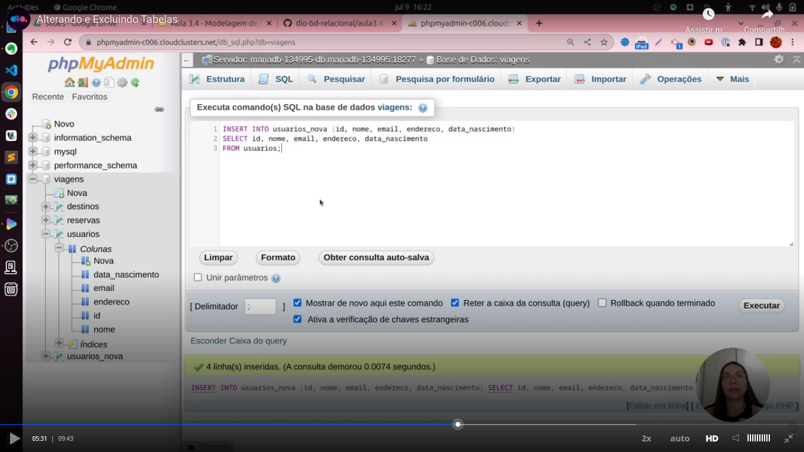
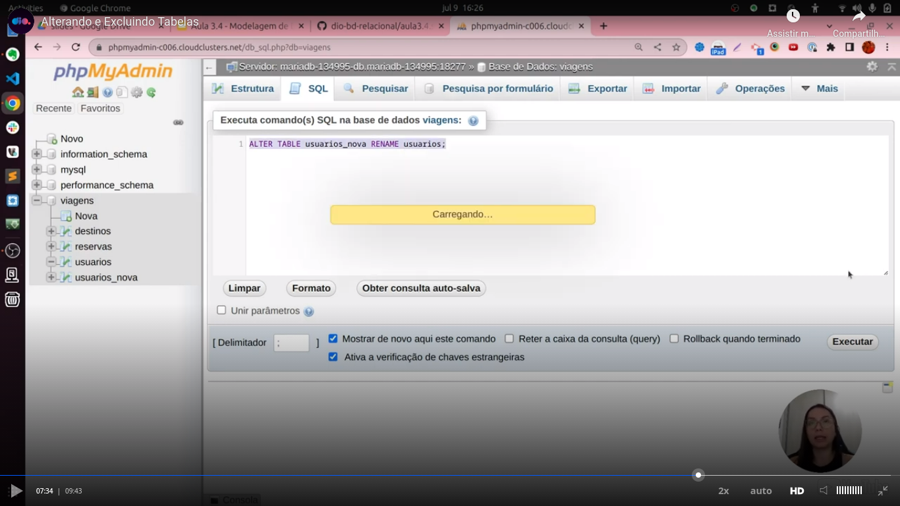

# General

[Initial class](https://web.dio.me/course/introducao-a-banco-de-dados-relacionais-sql/learning/bdaaa5d8-2d86-49e6-b166-ae890d0112b0?back=/track/coding-the-future-claro-java-spring-boot&tab=undefined&moduleId=undefined)

I used [Creately](https://app.creately.com/) to make some diagrams as I learned in the course.

I accessed the "Curso" workspace 

I talk about Creately [in this video](https://youtu.be/F1A5UvZYZ_k).

In [this class](https://web.dio.me/course/introducao-a-banco-de-dados-relacionais-sql/learning/5e407a8c-9d57-4a20-965c-90d5208fb751?back=/track/coding-the-future-claro-java-spring-boot&tab=undefined&moduleId=undefined) the teacher created a database [in this site](https://clients.cloudclusters.io/). As the trial options were not exhibited to me, I created the database using the tools provided to my Hostinger acount.

Access data:
- hostname: please access [this link](https://hpanel.hostinger.com/websites/terceiro.com.br/databases/php-my-admin?redirectLocation=side_menu)
after loggin in in the administration pannel;
- database: u257595541_viagens
- username: u257595541_viagens
- password: if you access using the previous link, a password will be not necessary.

**OBS:** you will need to click in the **'Entrar no phpMyAdmin'** of the specific database.

This basically is what was teached about the creation of a table:

About the `select`or `insert` clausule I didn't learn any news except that I can use `<>` or `!=` in comparision with the meaning of "different" (I always used only "!=").

In the class about `update`and `delete` clausules I didn't noted any new information based in my current knowloegde.

The teacher used an interesting `insert ... select` in the class as you can see in the next image:

The teacher also renamed a table:

Modifying a column:

A important information to remember is that we can only have one `primary key`.

We can have null values in a `foreign key`:

Pay attention that the question of a `foreign key` receives a null value or no depends if that column received a `NULL` or `NOT NULL` constraint. Please see the insertion in `PHPMyAdmin`. There we have both:

- a null checkbok. The meaning is that the column in the register will receive a `NULL` value;
- the combobox (or select box) with specific values that are in the another table (where the reference points to). When you select a value the checkbox to select `null` as the value of the column is automatically selected.
